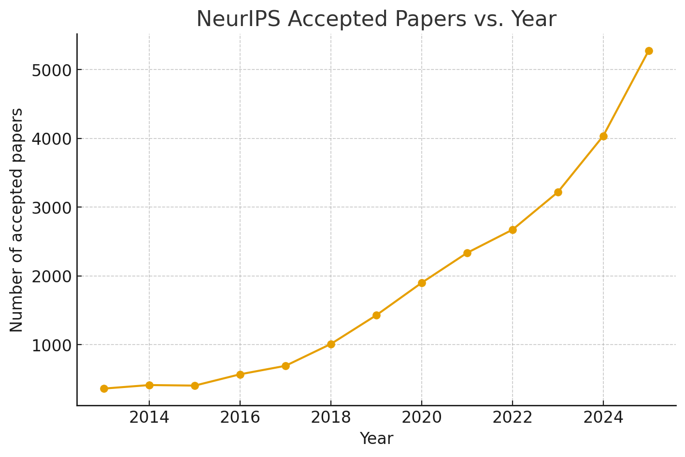
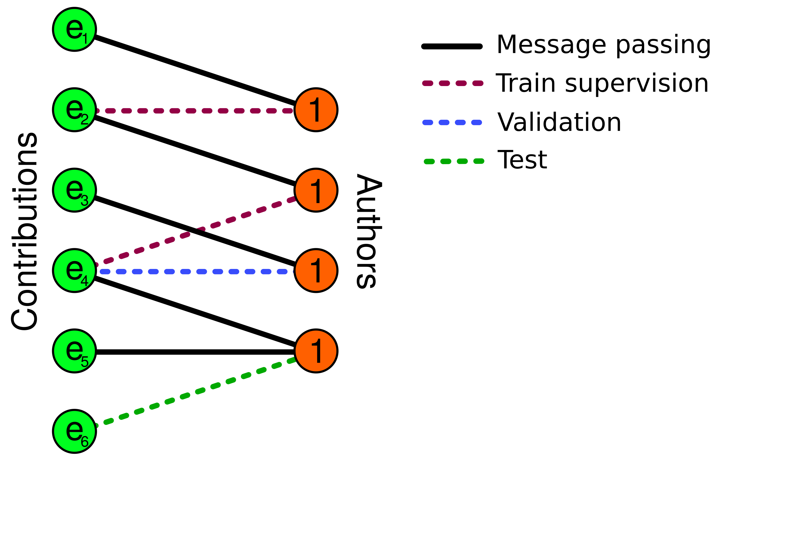

# PaperTrail: Graph-Based Personalized Paper Recommendations for Conference Authors

_By Jan-Lucas Uslu and Gregor Krzmanc as part of the Stanford CS224W course project_

_TL;DR We introduce **PaperTrail**, a graph-based recommendation system designed to assist conference authors in
discovering interesting papers.
In this blog post, we will discuss how we obtain the data and construct the graph,
as well as compare different recommendation algorithms._

Github repository: PALACEHOLDER FOR GITHUB LINK

## Information Overload at Large Conferences

At large conferences such as NeurIPS, ICML, and CVPR, the number of accepted papers has been growing rapidly over the years.
For example, in 2025, there were over 5000 papers accepted at NeurIPS alone.
With such a vast number of publications, it becomes increasingly challenging for authors to identify relevant papers
that align with their research interests and contribute meaningfully to their work.

To address this challenge, we attempt to build a recommendation system for conference authors.



_The growth of the number of accepted NeurIPS papers over the years. Source: <https://papercopilot.com/statistics/NeurIPS-statistics/>_

## Problem Statement

Building a recommendation system that would recommend similar papers to authors based on their previous publications requires
a dataset of papers and their authors, so that it can learn the paper authorship patterns.

The goal is to build a model that, given an author node, can recommend papers that the author might be interested in, based on the papers they have authored in the past.
In other words, we can represent this as a link prediction task on a bipartite graph, where one set of nodes represents authors, the other set represents papers, and the edges represent authorship relations between authors and papers.

## Data Collection and Preprocessing

We constructed the PaperTrail dataset by scraping data from websites of various large conferences: NeurIPS, ICLR,
ICML, ICCV, ECCV, and CVPR.
The scraped data contains the titles and abstracts of the papers, as well as the list of authors for each paper.
Here the first challenge is to correctly identify and disentangle the authors, as there are many authors with the same name.
Therefore, some authors may have the wrong set of papers associated with them.

When it comes to constructing the graph from raw data, we apply several preprocessing steps to ensure the dataset is suitable for model development.

Initially, 51% of the author nodes have degree 1 (i.e., 51% of the authors have only authored one paper in the dataset).
Of course, this means that many links that we would like to predict and evaluate our model on are impossible to predict, as the model only propagates information through existing edges.
Therefore, we filter out the authors with less than 3 papers, as well as the papers with less than 2 authors
and more than 50 authors.
After this filtering step, the degree distributions of the author and paper nodes are displayed in the figure below.


_Degree distribution of the author and paper nodes, after removing the
papers with more than 50 authors and less than 2 authors, as well as the authors with less than 3 papers._

After preprocessing, we use the _text-embedding-3-large_ model from OpenAI to generate the paper embeddings based on the title and abstract of each paper.
To make the embedding dimensionality more manageable, we opt to crop the embeddings to the first 256 dimensions.
This is possible with the embeddings of the _text-embedding-3-large_ model as the model was trained using the Matrioshka [CITE AND UPDATE] approach, where the first dimensions capture the most important information.

All dataset are available in our GitHub repository.


_The bipartite graph structure of the PaperTrail dataset. The papers carry LLM-generated initial node features, whereas
the author nodes are initialized with a vector of constants._

## Dataset Split Setup for Link Prediction

Training a link prediction model requires removing some edges from the graph, and attempting to predict them based
on the remaining edges (message passing edges).
The removed edges are partitioned into a training (training supervision) set, as well as validation and test sets
for model evaluation:


_Link splitting for a link prediction problem on the author-paper bipartite graph. The model only sees the message passing edges and the loss
is optimized using the train supervision edges._

We use a random link split using the `RandomLinkSplit` transform from PyG [2] to create training, validation, and test sets.

## Models

We use a simple dot product decoder to compute the scores between authors and papers based on their embeddings ($h_i$ and $h_j'$):

$f(h_i, h_j') = h_i^T h_j'$

<!-- ### Popularity baseline (can remove)

As a simple baseline, we consider a _popularity-based_ recommendation system.
Here, we assume that the score between an author and a paper is simply the product of their degrees, so basically the
number of the papers the author has co-authored, multiplied by the number of authors of the paper. This extremely simple
baseline serves as an additional sanity check whether our GNN-based models can outperform such a naive approach.

### Text dot product baseline (can remove)

Likely, similar papers to the ones an author has already written are relevant to the author.
Therefore, we consider a baseline without using the graph structure, where we simply average the embeddings of the
papers an author has coauthored, and set this to be the author embedding.
Of course, the embedding averages are computed using the training message-passing index and not the full graph in order
to avoid data leakage. -->

### Neural Graph Collaborative Filtering (NGCF)

Neural Graph Collaborative Filtering (NGCF) [3] is a graph neural network architecture for collaborative filtering that operates directly on the user-item interaction graph.
In our setting, we treat authors as users and papers as items, with an edge indicating authorship.

Starting from initial author and paper embeddings $h^{(0)}$, NGCF repeatedly propagates information through the bipartite graph to capture higher-order connectivities (i.e., multi-hop relationships between authors and papers).
At each layer, it applies learnable feature transformations and nonlinearities.
It also augments message passing with a _bi-interaction_ term that explicitly models feature interactions between a node and its neighbor.

The layer-wise embedding update for a node $i$ can be written as:

$$
h_i^{(k)} = \sigma\left(
\sum_{j \in N(i)} \frac{1}{\sqrt{|N(i)|} \sqrt{|N(j)|}}
\left(
W_1^{(k)} h_j^{(k-1)} + W_2^{(k)} \left(h_j^{(k-1)} \odot h_i^{(k-1)}\right)
\right)
\right),
$$

where $W_1^{(k)}$ and $W_2^{(k)}$ are learnable weight matrices, $\odot$ denotes element-wise product, and $\sigma$ is typically a LeakyReLU activation.

Finally, NGCF concatenates the representations from all layers to form the final embedding used by our dot product decoder:

$$ h_i = h_i^{(0)} \,\|\, h_i^{(1)} \,\|\, \dots \,\|\, h_i^{(K)}. $$

Overall, NGCF is a more expressive but heavier model than LightGCN.
It introduces additional parameters and nonlinearities that can improve performance, but also increase training cost and the risk of overfitting.
Next, we consider LightGCN, which simplifies NGCF by removing feature transformation and nonlinearities while retaining neighborhood aggregation.

### LightGCN

LightGCN [1] is a streamlined graph convolutional model tailored to recommendation on bipartite interaction graphs.
It can be viewed as a simplification of NGCF that removes feature transformation and nonlinear activation functions.
Each layer therefore performs only normalized neighborhood aggregation.

At layer $k$, the embedding of a node $i$ is updated by aggregating its neighbors:

$$ h_i^{(k)} = \sum_{j \in N(i)} \frac{1}{\sqrt{|N(i)|} \sqrt{|N(j)|}} h_j^{(k-1)} $$

Here, $N(i)$ denotes the neighbors of node $i$ in the author-paper graph.
The symmetric normalization term prevents high-degree nodes from dominating the propagation.

To obtain the final representation, LightGCN combines the embeddings from all layers:

$$ h_i = \sum_{k=0}^{K} \alpha_k h_i^{(k)}. $$

For the final embeddings, we use $K=3$ layers of neighborhood aggregation and set all weights to be equal, i.e., $\alpha_k = \frac{1}{K+1}$, similarly to [1].
This layer aggregation mixes information from different hop distances and helps mitigate over-smoothing.

LightGCN is parameter-efficient and has been shown to perform very well on recommendation tasks.
However, it cannot incorporate node features beyond the learned embeddings, since it has no feature transformation layers.
It is also a transductive model, so authors and papers must be present in the training graph to receive meaningful embeddings.
Adding new authors or new papers requires learning new embeddings, which typically means retraining the model.

Regardless, we find that LightGCN performs very well on our PaperTrail dataset.

## Metrics

Evaluating a recommendation system can be tricky - even though our model can be viewed as a classifier assigning
a score to each possible author-paper pair, the vast majority of these pairs are negative samples (i.e., there should be no
link between the author and the paper). Therefore, standard classification metrics such as accuracy or area under the ROC
curve are not very informative in this setting.

We use the standard metrics for evaluating recommendation systems: Precision@K and Recall@K.
Precision@K measures the proportion of recommended papers in the top K that are relevant to the author,
while Recall@K measures the proportion of relevant papers that are included in the top K recommendations.
Both metrics are averaged across authors.

In order to retrieve top K recommendations for each author efficiently, we
divide the author list into batches and compute dot products between the current author and all the paper embeddings
efficiently using `torch.matmul`:

```python
    for start in range(0, user_ids.shape[0], batch_size):
        batched_user_ids = user_ids[start : start + batch_size]
        batched_user_embeddings = user_embedding[batched_user_ids]
        batched_scores = torch.matmul(batched_user_embeddings, item_embedding.T)
        for batch_index, user_id in enumerate(batched_user_ids.tolist()):
            seen_items = set()
            for exclude_dict in exclude_user_id_to_ground_truth_indices:
                seen_items.update(exclude_dict.get(user_id, []))
            if seen_items:
                batched_scores[batch_index, list(seen_items)] = -1e9
        _, top_K_indices[start : start + batch_size] = torch.topk(
            batched_scores,
            k=k,
            dim=1,
        )
```

Note that in above code we exclude the links that appear in training through `exclude_user_id_to_ground_truth_indices`. See the full code for more details.

## Results

## Conclusion

## References

[1] He, Xiangnan, et al. “LightGCN: Simplifying and Powering Graph Convolution Network for Recommendation.” arXiv:2002.02126, arXiv, 7 July 2020. arXiv.org, <https://doi.org/10.48550/arXiv.2002.02126>.

[2] Fey, Matthias, and Jan E. Lenssen. “Fast Graph Representation Learning with PyTorch Geometric.” ICLR Workshop on Representation Learning on Graphs and Manifolds, 2019.

[3] Wang, Xiang, et al. “Neural Graph Collaborative Filtering.” arXiv:1905.08108, arXiv, 3 July 2020. arXiv.org, <https://doi.org/10.48550/arXiv.1905.08108>.
