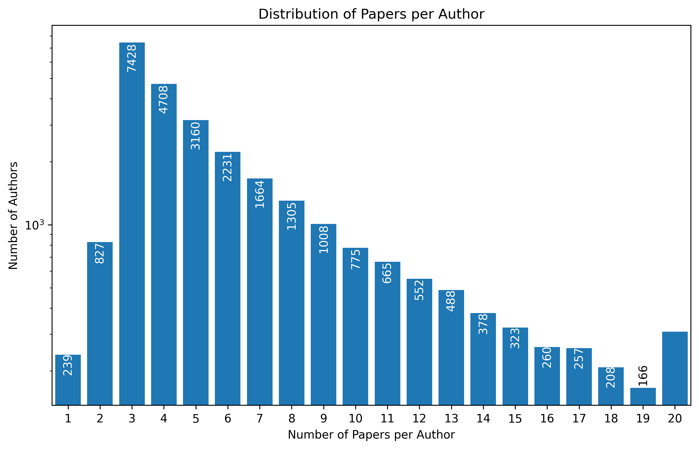

# PaperTrail: Graph-Based Personalized Paper Recommendations for Conference Authors

By Jan-Lucas Uslu and Gregor Krzmanc as part of the Stanford CS224W course project

_TL;DR We introduce **PaperTrail**, a graph-based recommendation system designed to assist conference authors in
discovering interesting papers.
In this blog post, we will discuss how we obtain the data, construct the graph and train a model on it._

Github repository: PALACEHOLDER FOR GITHUB LINK

## Information Overload at Large Conferences

At large conferences such as NeurIPS, ICML, and CVPR, the number of accepted papers has been growing rapidly over the years.
For example, in 2025, there were over 5000 papers accepted at NeurIPS alone.
With such a vast number of publications, it becomes increasingly challenging for authors to identify relevant papers
that align with their research interests and contribute meaningfully to their work.

To address this challenge, we attempt to build a recommendation system for conference authors.


_The growth of the number of accepted NeurIPS papers over the years. Source: <https://papercopilot.com/statistics/NeurIPS-statistics/>_

## Problem Statement

Building a recommendation system that would recommend similar papers to authors based on their previous publications requires a dataset of papers and their authors, so that it can learn the paper authorship patterns.

The goal is to build a model that, given an author node, can recommend papers that the author might be interested in, based on the papers they have authored in the past.
In other words, we can represent this as a link prediction task on a bipartite graph, where one set of nodes represents authors, the other set represents papers, and the edges represent authorship relations between authors and papers.


_The graph structure of a conference. Here, authors are connected to the contributions they have authored, giving rise to a bipartite graph structure. In this example each node carries an initial embedding vector. While the authors are initialized with a vector of ones, the contributions are initialized with text-embeddings obtained from their abstracts.._

## Data Collection and Preprocessing

To construct the PaperTrail dataset, we scraped data from the websites of several major conferences, including NeurIPS, ICLR, ICML, ICCV, ECCV, and CVPR.

The raw scraped data contains the titles, URLs, year, conference and abstracts of the contributions, as well as the list of authors for each paper.
Here we are faced with a problem of name disambiguation, as many authors may share the same name.
In the current dataset it is not possible to fully resolve this issue, so some authors may have incorrect sets of papers associated with them.
In future work one may be able to look up each paper on OpenReview or Semantic Scholar to obtain unique author IDs, which would help to resolve this issue.

To bring the data into a useful format for model training, we first apply several filtering and preprocessing steps.

Initially, ~48% of the author nodes have degree 1 (i.e., 48% of the authors have only authored one paper in the dataset).
Of course, this means that many links that we would like to predict and evaluate our model on are impossible to predict, as the model only propagates information through existing edges.
If we would use the edges as validation edges, the model could not update the author node embedding based on any message passing, as there are no remaining edges connected to the author node.
Therefore, we filter out the authors with less than 3 papers, as well as the papers with less than 2 authors
and more than 20 authors to stabilize the training.



_Degree distribution of the author and paper nodes, after removing the
papers with more than 20 authors and less than 2 authors, as well as the authors with less than 3 papers.
As we remove both papers and authors, we still get some authors with less than 3 papers, but the fraction is much smaller now._

After preprocessing, we use the _text-embedding-3-large_ model from OpenAI to generate the paper embeddings based on the title and abstract of each paper.
To make the embedding dimensionality more manageable, we opt to crop the embeddings to the first 256 dimensions.
This is possible with the embeddings of the _text-embedding-3-large_ model as the model was trained using the Matrioshka approach [4], where the first dimensions capture the most important information.

All dataset are available in our GitHub repository.

## Dataset Split Setup for Link Prediction

Training a link prediction model requires removing some edges from the graph, and attempting to predict them based
on the remaining edges (message passing edges).
The removed edges are partitioned into a training (training supervision) set, as well as validation and test sets
for model evaluation:


_Link splitting for a link prediction problem on the author-paper bipartite graph. The model only sees the message passing edges and the loss
is optimized using the train supervision edges._

We use a random link split using the `RandomLinkSplit` transform from PyG [2] to create training, validation, and test sets.

```python
train_data, val_data, test_data = T.RandomLinkSplit(
    num_val=0.1, # 10% of the edges are used for validation
    num_test=0.1, # 10% of the edges are used for testing
    neg_sampling_ratio=0.0, # no negative sampling, We are adding negative samples on the fly
    disjoint_train_ratio=0.3, # 30% of the training edges are used for training supervision
    add_negative_train_samples=False, # Again, we are adding negative samples on the fly
    is_undirected=True, # the graph is undirected
    edge_types=[("author", "writes", "paper")], # the type of edges we are interested in predicting
    rev_edge_types=[("paper", "rev_writes", "author")], # We dont want to accidentally leak information from the reverse edges
)(data)
```

## Models

We use a simple dot product decoder to compute the scores between authors and papers based on their embeddings ($h_i$ and $h_j'$):

$f(h_i, h_j') = h_i^T h_j'$

### Neural Graph Collaborative Filtering (NGCF)

Neural Graph Collaborative Filtering (NGCF) [3] is a graph neural network architecture for collaborative filtering that operates directly on the user-item interaction graph.
In our setting, we treat authors as users and papers as items, with an edge indicating authorship.

Starting from initial author and paper embeddings $h^{(0)}$, NGCF repeatedly propagates information through the bipartite graph to capture higher-order connectivities (i.e., multi-hop relationships between authors and papers).
At each layer, it applies learnable feature transformations and nonlinearities.
It also augments message passing with a _bi-interaction_ term that explicitly models feature interactions between a node and its neighbor.

The layer-wise embedding update for a node $i$ can be written as:

$$
h_i^{(k)} = \sigma\left(
\sum_{j \in N(i)} \frac{1}{\sqrt{|N(i)|} \sqrt{|N(j)|}}
\left(
W_1^{(k)} h_j^{(k-1)} + W_2^{(k)} \left(h_j^{(k-1)} \odot h_i^{(k-1)}\right)
\right)
\right),
$$

where $W_1^{(k)}$ and $W_2^{(k)}$ are learnable weight matrices, $\odot$ denotes element-wise product, and $\sigma$ is typically a LeakyReLU activation.

Finally, NGCF concatenates the representations from all layers to form the final embedding used by our dot product decoder:

$$ h_i = h_i^{(0)} \,\|\, h_i^{(1)} \,\|\, \dots \,\|\, h_i^{(K)}. $$

Overall, NGCF is a more expressive but heavier model than LightGCN.
It introduces additional parameters and nonlinearities that can improve performance, but also increase training cost and the risk of overfitting.
Next, we consider LightGCN, which simplifies NGCF by removing feature transformation and nonlinearities while retaining neighborhood aggregation.

### LightGCN

LightGCN [1] is a streamlined graph convolutional model tailored to recommendation on bipartite interaction graphs.
It can be viewed as a simplification of NGCF that removes feature transformation and nonlinear activation functions.
Each layer therefore performs only normalized neighborhood aggregation.

At layer $k$, the embedding of a node $i$ is updated by aggregating its neighbors:

$$ h*i^{(k)} = \sum*{j \in N(i)} \frac{1}{\sqrt{|N(i)|} \sqrt{|N(j)|}} h_j^{(k-1)} $$

Here, $N(i)$ denotes the neighbors of node $i$ in the author-paper graph.
The symmetric normalization term prevents high-degree nodes from dominating the propagation.

To obtain the final representation, LightGCN combines the embeddings from all layers:

$$ h*i = \sum*{k=0}^{K} \alpha_k h_i^{(k)}. $$

For the final embeddings, we use $K=3$ layers of neighborhood aggregation and set all weights to be equal, i.e., $\alpha_k = \frac{1}{K+1}$, similarly to [1].
This layer aggregation mixes information from different hop distances and helps mitigate over-smoothing.

LightGCN is parameter-efficient and has been shown to perform very well on recommendation tasks.
However, it cannot incorporate node features beyond the learned embeddings, since it has no feature transformation layers.
It is also a transductive model, so authors and papers must be present in the training graph to receive meaningful embeddings.
Adding new authors or new papers requires learning new embeddings, which typically means retraining the model.

Regardless, we find that LightGCN performs very well on our PaperTrail dataset.

### GraphSage

We also experiment with GraphSage, which is a simple and scalable graph convolutional network.
Using GraphSage, we can incorporate node features (such as paper embeddings) directly into the model.
GraphSage is an inductive model, which means it can generalize to new nodes not seen during training.
This makes it a good choice for our task, as we may want to recommend papers to new authors or new papers without retraining the model.
The layer-wise embedding update for a node $i$ in GraphSage can be written as:

$$
h_i^{(k)} = \sigma\left(
\sum_{j \in N(i)} \frac{1}{|N(i)|} \mathbf{W}^{(k)}_1 h_j^{(k-1)} + \mathbf{W}^{(k)}_2 h_i^{(k-1)}
 \right),
$$

Where $\mathbf{W}^{(k)}_1$ and $\mathbf{W}^{(k)}_2$ are learnable weight matrices, and $\sigma$ is some nonlinearity function.
We can see that the model has self-loop terms that allow the model to use information from the node itself, which is useful for incorporating node features.

## Loss

For the link prediction task, one typically uses the binary cross-entropy loss function to train the model.
One problem with this approach is that this pushes the scores for all negative edges below the scores of all positive edges.
This is not always necessary, as we only want the positive edges to be better than the negative edges per user, not necessarily globally.
To address this issue, we use the Bayesian Personalized Ranking (BPR) loss function, which only pushes the scores for negative edges below the scores of the positive edges for each user.
The BPR loss function is defined as:

$$
\mathcal{L} = \frac{1}{|E(u^*)|\;|E_{\text{neg}}(u^*)|}
\sum_{(u^*, v_{\text{pos}})\in E(u^*)}
\sum_{(u^*, v_{\text{neg}})\in E_{\text{neg}}(u^*)}
-\log\!\left(
\sigma\big(f_\theta(u^*, v_{\text{pos}}) - f_\theta(u^*, v_{\text{neg}})\big)
\right)
$$

In code this is implemented very simply as:

```python
def BPR_loss(
    pos_scores: torch.Tensor,
    neg_scores: torch.Tensor,
):
    """Computes the Bayesian Personalized Ranking (BPR) loss.

    Args:
        pos_scores (Tensor): Predicted scores for positive samples.
        neg_scores (Tensor): Predicted scores for negative samples.

    Returns:
        Tensor: Computed BPR loss.
    """
    loss = -torch.mean(F.logsigmoid(pos_scores - neg_scores))
    return loss
```

For this to work the positive and negative scores need to be "paired" correctly.
This means that for each author, we need to pair the positive edges with the negative edges.

## Metrics

Evaluating a recommendation system can be tricky - even though our model can be viewed as a classifier assigning
a score to each possible author-paper pair, the vast majority of these pairs are negative samples (i.e., there should be no
link between the author and the paper). Therefore, standard classification metrics such as accuracy or area under the ROC
curve are not very informative in this setting.

We use the standard metrics for evaluating recommendation systems: Precision@K and Recall@K.
Precision@K measures the proportion of recommended papers in the top K that are relevant to the author,
while Recall@K measures the proportion of relevant papers that are included in the top K recommendations.
Both metrics are averaged across authors.

## Training

We train our models using the Adam optimizer and the BPR loss function.
For all models a use a learning rate of 0.001, batch size of 16\*4096, and a maximum of 100000 iterations.
We also implemented a custom sampler that samples positive edges and negative edges from the train split.

```python
def sample_minibatch(
    data: HeteroData,
    edge_type: tuple,
    batch_size: int,
    neg_sample_ratio: int = 1,
) -> tuple:
    """Randomly samples indices of a minibatch given an adjacency matrix

    Args:
        data (HeteroData): graph data object
        edge_type (tuple): edge type to sample from
        batch_size (int): minibatch size
        neg_sample_ratio (int): number of negative samples per positive sample

    Returns:
        tuple: pos_edge_index, neg_edge_index
    """
    # These are the supervised edges
    edge_label_index = data[edge_type].edge_label_index

    # These are the message passing edges
    # WE will use them to extract the dst node ids
    edge_index = data[edge_type].edge_index
    dst_ids = torch.unique(edge_index[1])

    # Here we get the number of all sueprvised edges so we can later sample from them
    num_edges = edge_label_index.size(1)

    # We first randomly sample positive edges
    # This over-represents authors with many positive edges, but it's ok for now
    sampled_pos_edge_idxs = torch.randint(0, num_edges, (batch_size,))

    # Tile the author and positive paper indices according to neg_sample_ratio
    # We want to have N negative samples per positive sample, but each positive sample needs to be duplicated N times
    # This is important for the loss function later
    sampled_src_ids = edge_label_index[0, sampled_pos_edge_idxs].repeat(
        neg_sample_ratio
    )
    sampled_pos_dst_ids = edge_label_index[1, sampled_pos_edge_idxs].repeat(
        neg_sample_ratio
    )

    # Randomly sample negative paper indices
    # This may lead to false negatives, but its ok for now
    sampled_neg_dst_idxs = torch.randint(
        0,
        len(dst_ids),
        (batch_size * neg_sample_ratio,),
    )
    sampled_neg_paper_ids = dst_ids[sampled_neg_dst_idxs]

    return sampled_src_ids, sampled_pos_dst_ids, sampled_neg_paper_ids
```

This sampler is used in our training loop to get the positive and negative paired edges for the BPR loss.
For training we are using a negative sampling ratio of 10, which means that for each positive edge, we sample 10 negative edges.

The training loop itself is straightforward and follows the standard PyTorch training loop:

```python
for iter in range(ITERATIONS):

    # mini batching
    sampled_author_ids, sampled_pos_paper_ids, sampled_neg_paper_ids = (
        sample_minibatch(
            data=train_data,
            edge_type=TEST_EDGE_TYPE,
            batch_size=BATCH_SIZE,
            neg_sample_ratio=NEG_SAMPLE_RATIO,
        )
    )

    # forward propagation
    embeddings = model.forward(train_data)
    author_embeddings = embeddings["author"]
    paper_embeddings = embeddings["paper"]

    # compute scores using the default dot product decoder
    pos_scores = torch.sum(
        author_embeddings[sampled_author_ids] * paper_embeddings[sampled_pos_paper_ids],
        dim=1,
    )
    neg_scores = torch.sum(
        author_embeddings[sampled_author_ids] * paper_embeddings[sampled_neg_paper_ids],
        dim=1,
    )

    # loss computation
    train_loss = BPR_loss(pos_scores, neg_scores)

    # backward propagation
    optimizer.zero_grad()
    train_loss.backward()
    optimizer.step()
```

## Results

We evaluate our models on held-out author-paper edges and report Precision@K and Recall@K averaged over authors.
Unless stated otherwise, we use K=20 and exclude all training edges when retrieving the top-K recommendations.

### Quantitative results

Table 1 summarizes the quantitative performance of our models on the test split.
The values below are placeholders and will be updated once we run the final training sweep with fixed hyperparameters and seeds.

| Model                     | Recall@20 | Precision@20 | Notes                                                                    |
| ------------------------- | --------: | -----------: | ------------------------------------------------------------------------ |
| Text dot product baseline |       TBD |          TBD | Author embedding is the mean of embeddings of previously authored papers |
| GraphSage                 |       TBD |          TBD | Inductive model that incorporates node features                          |
| LightGCN                  |       TBD |          TBD | Transductive model that learns embeddings via neighborhood aggregation   |
| NGCF                      |       TBD |          TBD | Included as background and left for future work                          |

### Qualitative results

We also include a qualitative sanity check by inspecting the top-K recommendations for a small set of authors.
We will report a few representative examples where the recommended papers are topically aligned with the author’s prior work, as well as failure cases where the model recommends overly popular or off-topic papers.

## Conclusion

We introduced PaperTrail, a graph-based recommendation system designed to help conference authors discover relevant papers.
We built a large author-paper bipartite graph from scraped conference metadata and used LLM-generated text embeddings from titles and abstracts as paper node features.
We framed paper recommendation as a link prediction task and used a dot product decoder together with the BPR loss to optimize ranking quality.

We compared graph-based recommendation models that trade off expressivity, efficiency, and generalization.
LightGCN provides a strong and parameter-efficient transductive baseline, but it cannot naturally handle new authors or new papers without learning new embeddings.
GraphSage can incorporate node features and generalize inductively to unseen nodes, but its performance depends strongly on feature quality and neighborhood sampling.

There are several limitations in our current setup.
Author name ambiguity can merge different people or split a single person across name variants, which introduces noise into both training and evaluation.
Our evaluation treats most unobserved author-paper pairs as negatives, even though some may be relevant but unobserved interactions.
Finally, our current graph is largely static and does not explicitly model time, so it cannot prioritize recency or capture shifting research interests.

Future work could improve both data quality and modeling.
We can incorporate unique author identifiers from sources such as OpenReview or Semantic Scholar to reduce ambiguity and enrich metadata.
We can also add additional edge types such as co-authorship, citations, or topic similarity to make the graph structure more informative.
On the modeling side, we can implement NGCF and feature-aware LightGCN variants to better integrate text features while keeping the benefits of collaborative filtering on graphs.

## References

[1] He, Xiangnan, et al. “LightGCN: Simplifying and Powering Graph Convolution Network for Recommendation.” arXiv:2002.02126, arXiv, 7 July 2020. arXiv.org, <https://doi.org/10.48550/arXiv.2002.02126>.

[2] Fey, Matthias, and Jan E. Lenssen. “Fast Graph Representation Learning with PyTorch Geometric.” ICLR Workshop on Representation Learning on Graphs and Manifolds, 2019.

[3] Wang, Xiang, et al. “Neural Graph Collaborative Filtering.” arXiv:1905.08108, arXiv, 3 July 2020. arXiv.org, <https://doi.org/10.48550/arXiv.1905.08108>.

[4] Matryoshka Representation Learning <https://arxiv.org/abs/2205.13147>
