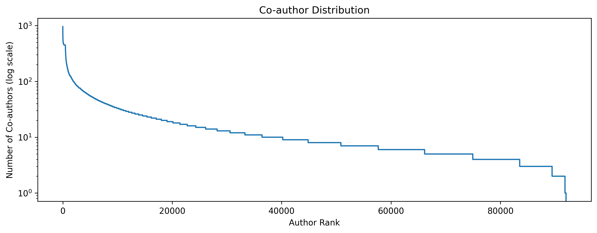

# PaperTrail: Graph-Based Personalized Paper Recommendations for Conference Authors

_By Jan-Lucas Uslu and Gregor Krzmanc as part of the Stanford CS224W course project_

At large conferences such as NeurIPS, ICML, and CVPR, the number of accepted papers has been growing rapidly over the years.
For example, in 2025, there were over 5000 papers accepted at NeurIPS alone.
With such a vast number of publications, it becomes increasingly challenging for authors to identify relevant papers
that align with their research interests and contribute meaningfully to their work.

To address this challenge, we introduce PaperTrail, a graph-based recommendation system designed to assist conference authors in discovering pertinent papers.
In this blog post, we will discuss how we obtained the data and construct the graph, as well as compare different recommendation algorithms.

## Dataset Construction and Preprocessing

We constructed the PaperTrail dataset by scraping the data from websites of various large conferences: NeurIPS, ICLR,
ICML, ICCV, ECCV, and CVPR.

We found that it's not possible to easily disentangle the authors with the same names.
Therefore, we may accidentally merge different authors into one node if they share the same name, which may degrade
performance.

We preprocess the data and filter it by removing the papers with only one author, as well as the paper with 450
different authors (see figure below).

We use the _text-embedding-3-large_ model from OpenAI to generate the paper embeddings based on the title
and abstract of each paper.

The preprocessed dataset in the end is a bipartite graph consisting of paper and author nodes.
The paper nodes are connected to author nodes via authorship edges.

The dataset is available for download as a PyG graph from httpXYZ.

## Metrics

We use the standard metrics for evaluating recommendation systems: Precision@K and Recall@K.
Precision@K measures the proportion of recommended papers in the top K that are relevant to the author,
while Recall@K measures the proportion of relevant papers that are included in the top K recommendations.

In order to retrieve top K recommendations for each author efficiently, we
divide the author list into batches and compute dot products between the author and paper embeddings

## Results

## Conclusion

## References

